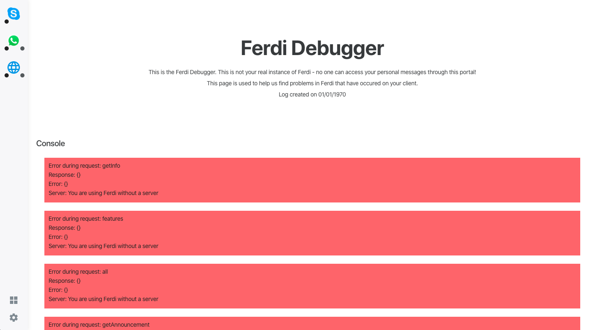
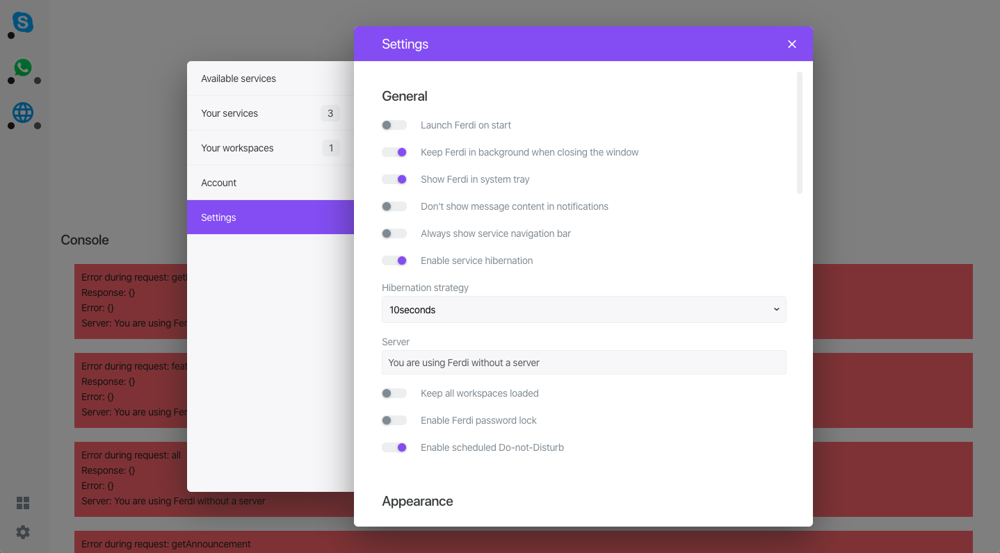

<p align="center">
      
</p>

# ferdium-debug
Webapp to help debug Ferdium issues.

The Ferdium debugger uses Ferdium's debug information to display a Ferdium-like webinterface in the browser. This webinterface allows us to check your configuration without having to crawl through raw JSON code.




## Setup
1. Clone this repository
2. Install the [AdonisJS CLI](https://adonisjs.com/)
3. Copy `.env.example` to `.env` and edit the [configuration](#configuration) to your needs
4. Run `npm install` to install local dependencies
5. Run the database migrations with
    ```js
    adonis migration:run
    ```
6. Start the server with
    ```js
    adonis serve --dev
    ```

## License
ferdium-debug is licensed under the MIT License
